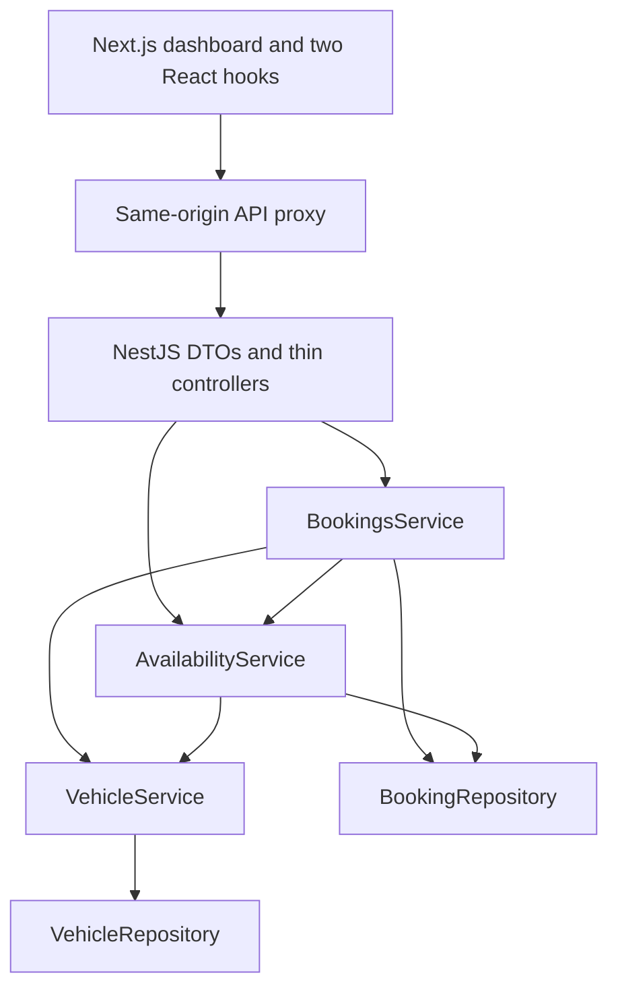

# Implementation plan and decisions

## Scope and source interpretation

The supplied implementation PDF and platform-neutral build prompt describe one feature: FleetSlot's complete vehicle operations scheduling slice. The selected repository was empty (a valid unborn branch with no commits); implementation therefore started from a small npm workspace monorepo. Document instructions were applied within the user's request to build this feature; their submission suggestions did not authorize publishing, pushing, recording a Loom, or inventing development history.

The initial implementation followed the platform-neutral prompt’s Swagger exclusion. Swagger was subsequently added at the project owner’s explicit request. `AI_JOURNEY.md` remains maintained separately by the owner. No automated test files are committed. Temporary verification scripts were run outside the checkout; their actual outcomes are recorded separately.

## Architecture

- `VehicleModule` owns the vehicle repository/service.
- `BookingStoreModule` exports the shared booking repository.
- `AvailabilityModule` imports those modules and calculates windows/conflicts directly from the repository, without depending on BookingsService.
- `BookingsModule` orchestrates complete candidate validation and synchronous create/update/delete.
- Constants are centralized in `backend/src/common/booking.constants.ts`.
- DTOs use class-validator/class-transformer, a strict global ValidationPipe, and Swagger’s mapped-type PartialType for updates so validation and OpenAPI metadata are both inherited. Explicit nulls are rejected; unknown properties cannot slip into storage.
- The UI uses a central API module and shared types, `useFleetScheduler` and `useAvailability`, focused components, and one token-driven stylesheet. AbortControllers prevent obsolete requests from replacing current filter/availability results.
- The shared create/edit form uses generated windows, displays authoritative 409 alternatives, and never silently resubmits. Native dialog provides focus containment, Escape handling, and focus restoration; closing is disabled during a save. Deletion requires confirmation.

## Delivery order

1. Generated the backend with the current NestJS CLI, then implemented constants, seeds, repositories, domain services, DTOs, and REST routes.
2. Built/type-checked and exercised the backend HTTP verification matrix before implementing frontend feature code.
3. Generated Next.js App Router with the official CLI, then implemented the data layer, dashboard, filters, dialog, slots, and conflict flow.
4. Built/type-checked both applications and verified real browser workflows and mobile layout.
5. Documented run instructions, API, limitations, verification, and reusable cloud setup.

## Adjustments and simplifications

- NestJS 12.1.2 and mapped-types 12.0.0 are used; the older mapped-types 2.x does not declare NestJS 12 peer compatibility. No force or legacy-peer-deps bypass was used.
- The current official Next.js CLI generated Next.js 16.4.0 rather than the PDF's 16.3.x. Generated TypeScript/ESM configuration was retained and exact dependencies are locked in the root lockfile.
- Both packages use one npm workspace lockfile and one root concurrently command. CLI-created example test files and irrelevant default assets were removed to match the specified scope.
- Tomorrow is initialized in the browser after hydration so static builds cannot freeze the default date or introduce a stale date hydration mismatch.
- The frontend uses a server-side Next.js rewrite instead of a browser-visible backend base URL. No extra credentials or browser network destinations are needed.
- Vehicle IDs are stable fictional `vehicle_1` through `vehicle_4`; new booking IDs use random UUIDs. Computed end time is calculated where needed, not persisted.
- Extra dashboard counts are derived from the filtered schedule. No global state library, database, or production infrastructure was added.

## Swagger addition

- `@nestjs/swagger` 12 is compatible with the NestJS 12 backend. Explicit DTO and controller metadata documents all seven operations, scheduling constraints, query optionality, response models, and machine-readable errors.
- `backend/src/swagger.ts` creates the shared OpenAPI document and serves Swagger UI plus YAML/JSON at `/api/docs`, `/api/swagger.yaml`, and `/api/swagger.json`. The server URL is relative so both the API and the existing frontend proxy work.
- `npm run swagger:generate` compiles into an isolated, ignored `backend/.swagger-build` folder and writes the root `swagger.yaml` without listening on a port or disturbing the running development build; `npm run swagger:check` detects differences from the current route/DTO metadata. Examples are fixed so generation is deterministic.
- UpdateBookingDto now imports PartialType from `@nestjs/swagger`, which also inherits the underlying mapped-types validation/transform metadata. `skipNullProperties: false` remains enabled, and full merged-candidate validation remains in BookingsService.

## Remaining constraints

In-memory state and single-process atomicity are intentional. Local dates assume compatible operator/server local timezones. Publication, GitHub push, cross-task snapshot restoration, and deployment are outside the checks performed here.
