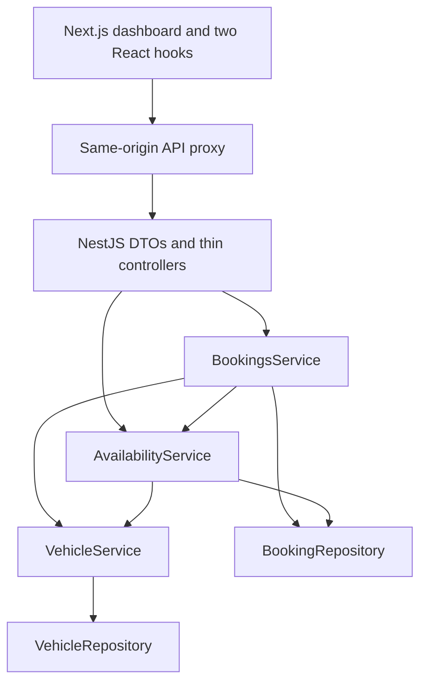

# Implementation plan and decisions

## Scope and source interpretation

The supplied implementation PDF and platform-neutral build prompt describe one feature: FleetSlot's complete vehicle operations scheduling slice. The selected repository was empty (a valid unborn branch with no commits); implementation therefore started from a small npm workspace monorepo. Document instructions were applied within the user's request to build this feature; their submission suggestions did not authorize publishing, pushing, recording a Loom, or inventing development history.

The initial implementation followed the platform-neutral prompt’s Swagger exclusion. Swagger was subsequently added at the project owner’s explicit request. `AI_JOURNEY.md` remains maintained separately by the owner. No automated test files are committed. Temporary verification scripts were run outside the checkout; their actual outcomes are recorded separately.

## Architecture

- `VehicleModule` owns the vehicle repository/service.
- `BookingStoreModule` exports the shared booking repository.
- `AvailabilityModule` imports those modules and calculates windows/conflicts directly from the repository, without depending on BookingsService.
- `BookingsModule` orchestrates complete candidate validation and synchronous create/update/delete.
- Constants are centralized in `backend/src/common/booking.constants.ts`.
- DTOs use class-validator/class-transformer, a strict global ValidationPipe, and Swagger’s mapped-type PartialType for updates so validation and OpenAPI metadata are both inherited. Explicit nulls are rejected; unknown properties cannot slip into storage.
- The UI uses a central API module and shared types, `useFleetScheduler` and `useAvailability`, focused components, and Tailwind utility styling backed by the original theme tokens. AbortControllers prevent obsolete requests from replacing current filter/availability results.
- The shared create/edit form uses generated windows, displays authoritative 409 alternatives, and never silently resubmits. Native dialog provides focus containment, Escape handling, and focus restoration; closing is disabled during a save. Deletion requires confirmation.

## Delivery order

1. Generated the backend with the current NestJS CLI, then implemented constants, seeds, repositories, domain services, DTOs, and REST routes.
2. Built/type-checked and exercised the backend HTTP verification matrix before implementing frontend feature code.
3. Generated Next.js App Router with the official CLI, then implemented the data layer, dashboard, filters, dialog, slots, and conflict flow.
4. Built/type-checked both applications and verified real browser workflows and mobile layout.
5. Documented run instructions, API, limitations, verification, and reusable cloud setup.

## Adjustments and simplifications

- NestJS 12.1.2 and mapped-types 12.0.0 are used; the older mapped-types 2.x does not declare NestJS 12 peer compatibility. No force or legacy-peer-deps bypass was used.
- The current official Next.js CLI generated Next.js 16.4.0 rather than the PDF's 16.3.x. Generated TypeScript/ESM configuration was retained and exact dependencies are locked in the root lockfile.
- Both packages use one npm workspace lockfile and one root concurrently command. CLI-created example test files and irrelevant default assets were removed to match the specified scope.
- Tomorrow is initialized in the browser after hydration so static builds cannot freeze the default date or introduce a stale date hydration mismatch.
- The frontend uses a server-side Next.js rewrite instead of a browser-visible backend base URL. No extra credentials or browser network destinations are needed.
- Vehicle IDs are stable fictional `vehicle_1` through `vehicle_4`; new booking IDs use random UUIDs. Computed end time is calculated where needed, not persisted.
- Extra dashboard counts are derived from the filtered schedule. No global state library, database, or production infrastructure was added.

## Swagger addition

- `@nestjs/swagger` 12 is compatible with the NestJS 12 backend. Explicit DTO and controller metadata documents all seven operations, scheduling constraints, query optionality, response models, and machine-readable errors.
- `backend/src/swagger.ts` creates the shared OpenAPI document and serves Swagger UI plus YAML/JSON at `/api/docs`, `/api/swagger.yaml`, and `/api/swagger.json`. The server URL is relative so both the API and the existing frontend proxy work.
- `npm run swagger:generate` compiles into an isolated, ignored `backend/.swagger-build` folder and writes the root `swagger.yaml` without listening on a port or disturbing the running development build; `npm run swagger:check` detects differences from the current route/DTO metadata. Examples are fixed so generation is deterministic.
- UpdateBookingDto now imports PartialType from `@nestjs/swagger`, which also inherits the underlying mapped-types validation/transform metadata. `skipNullProperties: false` remains enabled, and full merged-candidate validation remains in BookingsService.

## Tailwind migration

- At the owner’s request, Tailwind CSS 4.3.3 and the matching PostCSS plugin replace the custom component stylesheet. This was the stable npm `latest` release when installed.
- Original token names and values are preserved in the CSS-first `@theme static` definition. Semantic color, layout, radius, and shadow utilities reference those tokens. Only Tailwind setup and theme declarations remain in the stylesheet.
- Every frontend component now uses utilities, including responsive grids, native-dialog backdrop, hover/focus states, selected/disabled slots, notices, and reduced motion. Shared controls use plain reusable utility strings, without a component framework or `@apply` rules.
- Responsive thresholds retain the original 640/1000/1360px layout design. Operation color maps contain complete utility names for reliable build-time detection.
- API functions, hooks, validation, and scheduling behavior are unchanged by the styling migration.

## Interface redesign

The owner requested a redesign using the installed `Leonxlnx/taste-skill` collection. The applicable `redesign-existing-projects` skill guided an audit and targeted upgrades to the existing Next.js/Tailwind interface. The marketing-focused `design-taste-frontend` skill explicitly excludes dashboards, so its landing-page patterns were not applied here.

- Audit findings: sparse card columns made vehicle schedules unnecessarily tall; text glyphs were inconsistent across platforms; small card actions were difficult to target; inline deletion confirmation lacked context; request feedback was limited to a spinner or text.
- Design direction: a light operations workspace with compact rows grouped by vehicle, a restrained metric strip, legible local DM Sans typography, tabular time values, and consistent Phosphor icons. The FleetSlot wordmark and all existing color token names and values remain intact.
- Functional improvements: previous/next-day navigation, Today and refresh controls, clearable filters, useful empty/error states, board and availability skeletons, and explicit save/delete progress. No API contracts or backend scheduling rules changed.
- Shared native dialogs make the background inert and prevent background scrolling. Explicit Tab/Shift+Tab wrapping, focus restoration, reduced motion, independent form scrolling, and disabled pending controls support keyboard and mobile use.
- Deletion is managed above the schedule board so a board refresh cannot destroy its pending/error state. Confirmation includes the exact record details, defaults focus to cancellation, ignores backdrop clicks, and keeps failures open for retry. Successful deletion returns focus to the stable scheduling action.

## Expanded demo data

- Added four active demo vehicles: Toyota Corolla, Hyundai Tucson, Kia Sportage, and BMW 320i, preserving all original vehicle IDs and bookings.
- The seed now contains 80 bookings: seven original records and 73 generated records across tomorrow through day 14. All four new vehicles appear on the default tomorrow board.
- A fixed random seed produces varied but reproducible schedules using realistic operation templates. Dates remain relative to backend startup. Candidate starts are checked against existing bookings and the shared scheduling constants; inactive vehicles receive no additional work.

## Remaining constraints

In-memory state and single-process atomicity are intentional. Local dates assume compatible operator/server local timezones. Environment publication, cross-task snapshot restoration, and deployment are outside the checks performed here.
